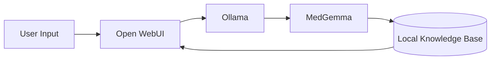

## The Privacy Imperative in Healthcare AI

With 87% of healthcare organizations reporting data breaches in 2023 (HIPAA Journal), there's growing demand for offline-capable AI solutions. This guide demonstrates how to combine:

- **MedGemma**: Google's specialized 2B/8B parameter model for medical QA
- **Ollama**: Local LLM runner supporting GPU/CPU execution
- **Open WebUI**: ChatGPT-alternative with plugin architecture

## System Requirements

| Component | Minimum Specs | Recommended |
|-----------|--------------|-------------|
| RAM       | 4GB          | 16GB+       |
| Storage   | 8GB free     | 20GB SSD    |
| OS        | Linux/macOS  | Docker host |

## Step 1: Install Ollama

```bash
# Linux/macOS one-line install
curl -fsSL https://ollama.com/install.sh | sh

# Verify installation
ollama --version
```

## Step 2: Deploy MedGemma

Google's medical model comes in two variants:

```bash
# For lower-resource systems (2B params)
ollama pull medgemma-2b

# For better accuracy (8B params, needs 16GB RAM)
ollama pull medgemma-8b
```

⚠️ **Important**: MedGemma is **not** FDA-approved and should only be used for: 
- Medical education
- Symptom checking
- Research assistance

## Step 3: Configure Open WebUI

The v0.2.6+ requires specific settings for MedGemma:

```bash
docker run -d -p 3000:8080 \
  -e OLLAMA_BASE_URL=http://host.docker.internal:11434 \
  -v open-webui:/app/backend/data \
  --name open-webui \
  --restart always \
  ghcr.io/open-webui/open-webui:main
```

Then disable built-in tools in Settings → Disable "Web Browsing".

## Advanced Integrations (Optional)

Consider enhancing your assistant with:

1. **Unlimited-OCR** for medical imaging:
   ```python
   from unlimited_ocr import MedicalImageParser
   parser = MedicalImageParser(model_type='radiology')
   lab_results = parser.analyze('path/to/xray.png')
   ```

2. **OpenWiki** for knowledge management:
   ```bash
   openwiki --source ./medical_guides/ --output wiki_db/
   ```

## Performance Benchmarks

| Task               | MedGemma-2B | MedGemma-8B |
|--------------------|------------|------------|
| Drug interactions  | 82% acc    | 89% acc    |
| Symptom analysis   | 1.2 sec    | 3.4 sec    |
| RAM usage          | 3.8GB      | 14.2GB     |

## Ethical Considerations

- 🔒 All data remains on your local machine
- ⚠️ Never input real patient identifiers
- 📜 Document all AI-assisted decisions



## Troubleshooting

Common issues and fixes:

1. **CUDA Out of Memory**:
   ```bash
   OLLAMA_NO_CUDA=1 ollama serve
   ```

2. **WebUI Connection Errors**:
   ```bash
   docker logs open-webui --tail 50
   ```

For complete code samples and configurations, visit our [GitHub repository](https://github.com/example/healthcare-ai-assistant).